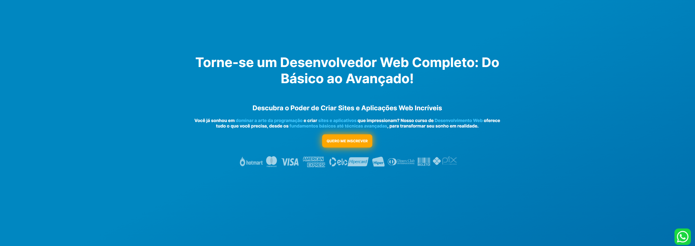
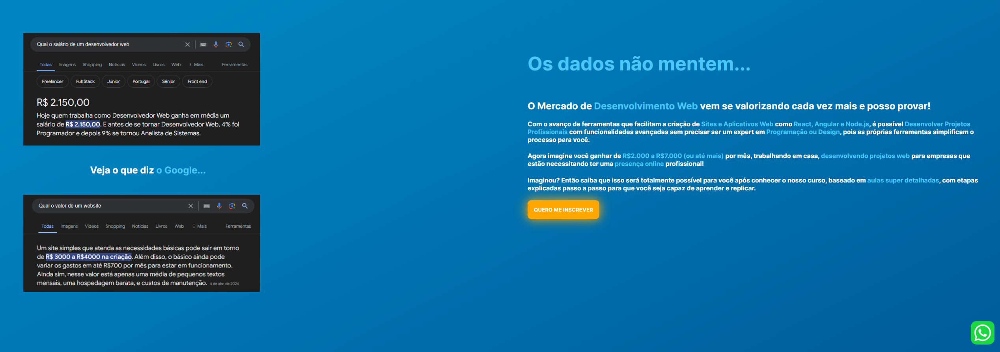
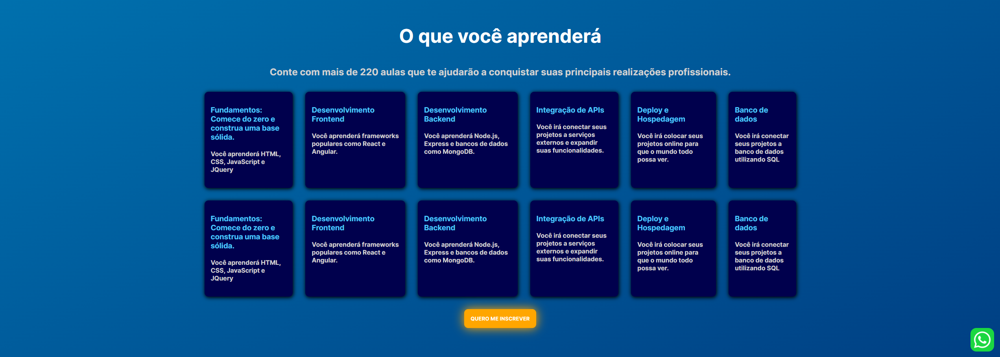
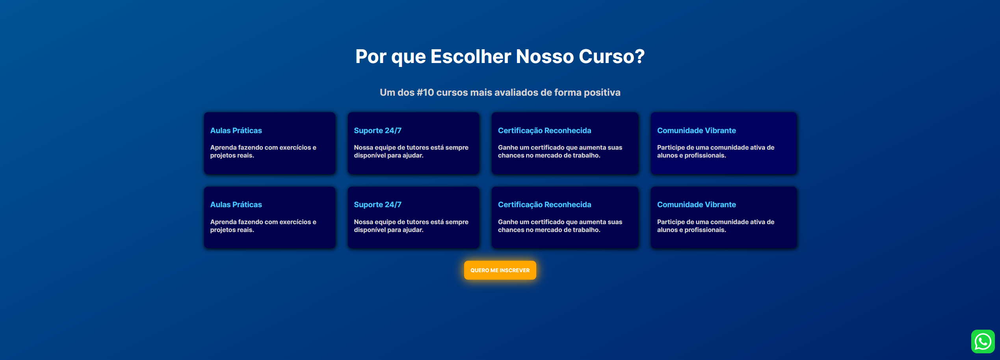
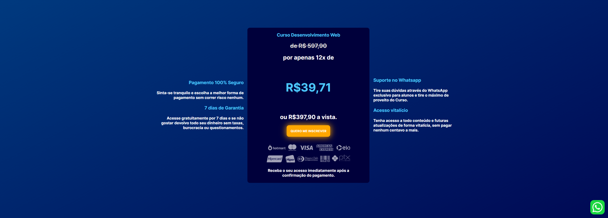
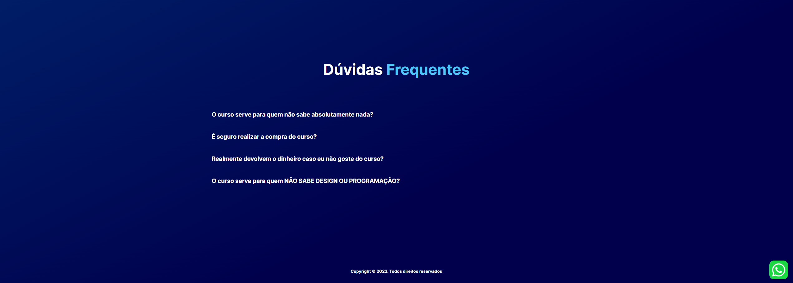

<h1>Landing Page para um curso de Desenvolvimento Web</h1>

  

<h3>Esse projeto foi desenvolvido com o objetivo de aperfeiçoar as minhas habilidades em Design de sites e Desenvolvimento FrontEnd</h3>

  
  
  
  
  
  

